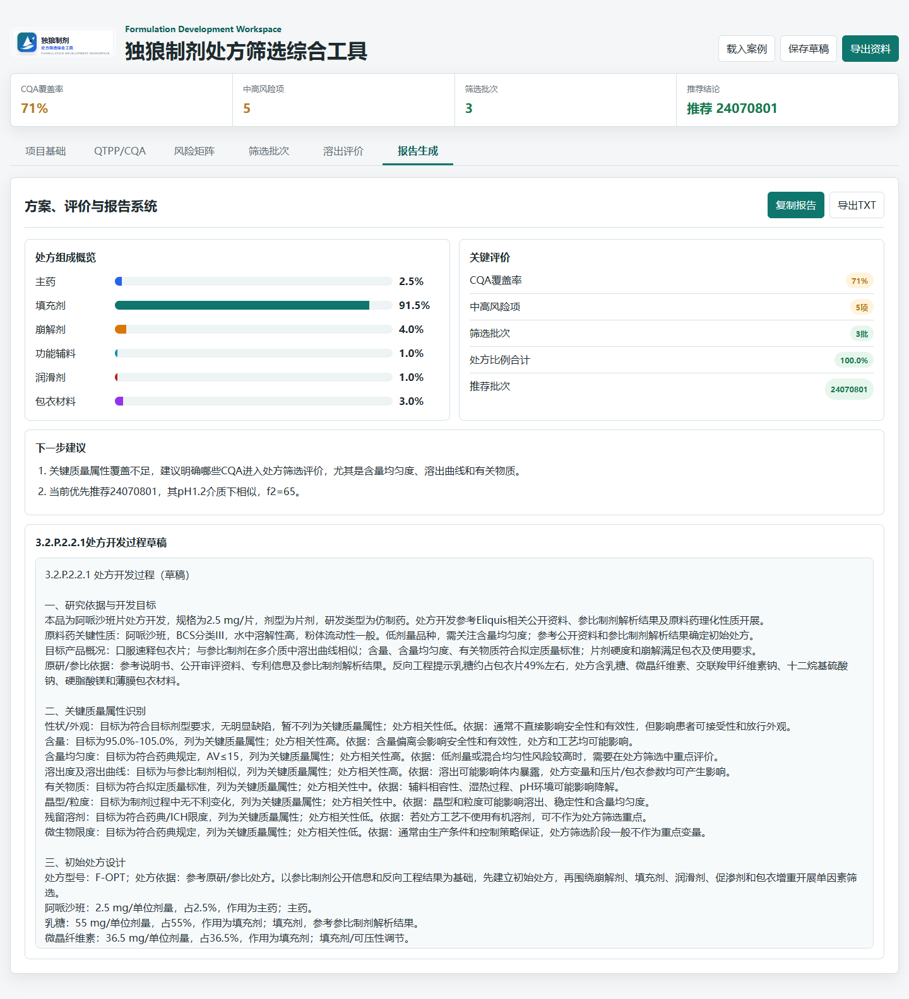

<p align="center">
  
</p>

<h1 align="center">方研智枢</h1>

<p align="center">
  制剂开发与报告系统：面向化学药品制剂研发的处方开发方案、实验记录、结果评价与报告生成工具。
</p>

<p align="center">
  <a href="https://fangyan-formucore.onrender.com">在线访问 Render 页面</a>
</p>

方研智枢是一个面向化学药品制剂研发的静态网页工具，目标是沉淀为“可复用的处方开发方案、实验记录、结果评价、报告系统生成工具”。当前版本重点把处方开发的核心链条打通：从项目基础信息、QTPP/CQA、风险识别、处方筛选批次、溶出评价到报告草稿输出。

## 页面预览



## 当前模块

1. 项目基础与原研信息
   - 录入项目名称、剂型、规格、研发类型、BCS 分类、原料药关键理化性质、参比制剂/原研信息和 QTPP。
   - 根据药品名称生成 Google、DailyMed、Drugs@FDA、Orange Book 等检索入口，便于后续人工核实并导入依据。

2. QTPP/CQA 与风险矩阵
   - 建立目标产品质量概况和关键质量属性清单。
   - 支持从处方成分自动生成风险矩阵，并记录风险等级、影响 CQA、控制策略和下一步试验。

3. 处方筛选与实验记录
   - 固定处方筛选框架，包含处方型号、处方依据、处方成分、处方角色和处方比例。
   - 默认覆盖主药、填充剂、崩解剂、黏合剂、功能辅料、润滑剂、助流剂、包衣材料、其他辅料等角色，使用者可增减。
   - 记录筛选批次、变量水平、关键工艺参数、片重差异、硬度、脆碎度、崩解、含量均匀度、溶出和结论。

4. 结果评价与报告生成
   - 计算 CQA 覆盖率、风险项数量、处方组成比例和溶出曲线 f2。
   - 生成关键评价、下一步建议、处方组成概览和 `3.2.P.2.2.1 处方开发过程`草稿。
   - 支持将当前工作区保存到浏览器 localStorage，并导出 JSON/TXT 文件。

## 本地运行

这是纯静态页面，直接打开 `index.html` 即可使用；也可以启动本地静态服务器：

```powershell
python -m http.server 5174
```

然后访问 `http://localhost:5174`。

## Render 部署

仓库包含 `render.yaml`，可在 Render 中作为 Static Site 部署。

- Build Command: 留空
- Publish Directory: `.`

## 后续优化方向

1. 建立结构化资料库：API 性质、辅料库、参比制剂信息、处方版本、工艺参数、检验结果和报告模板。
2. 扩展剂型模板：片剂、胶囊、颗粒、口服液、注射剂分别建立 CQA、风险因素和评价规则。
3. 引入 DOE：支持单因素、正交、Plackett-Burman、响应面和混料设计。
4. 增加合规联网模块：通过公开数据库和合规 API 辅助检索原研/参比信息，但最终结论应由研发人员核实。
5. 强化报告系统：生成内部汇报、处方筛选总结、工艺开发概览和注册资料草稿。
